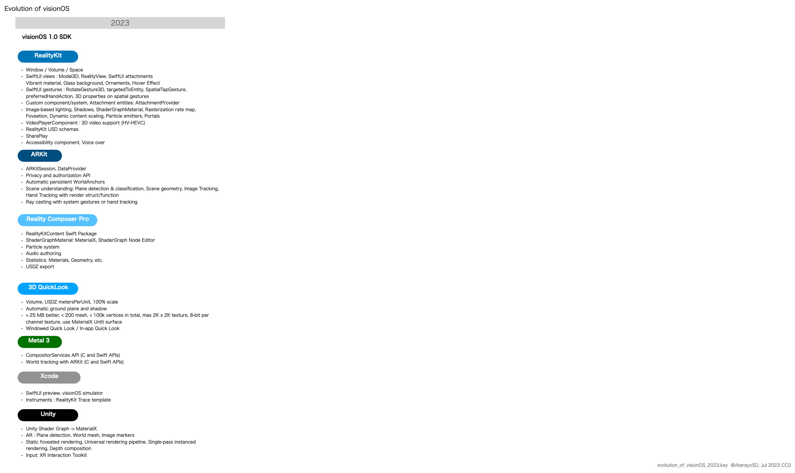
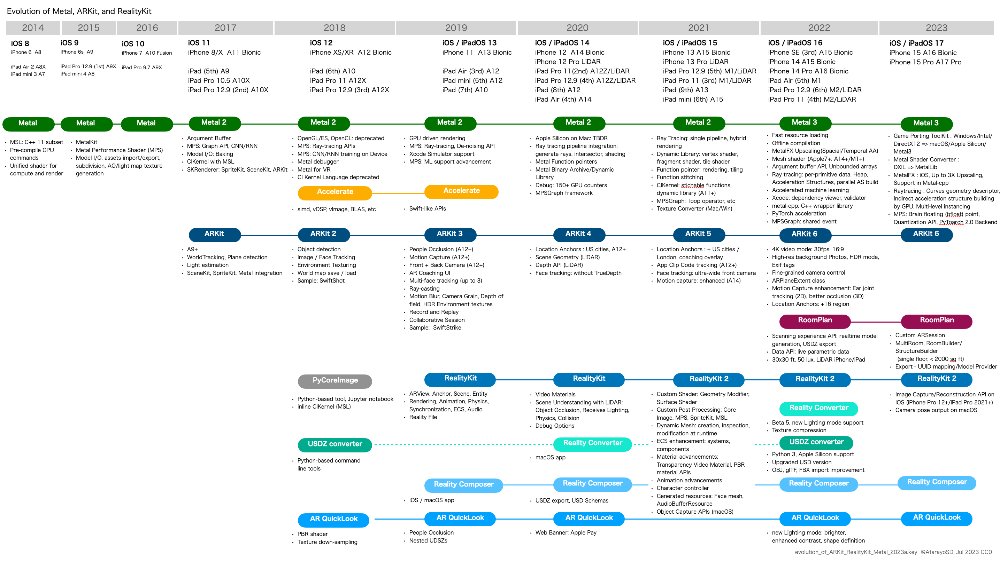
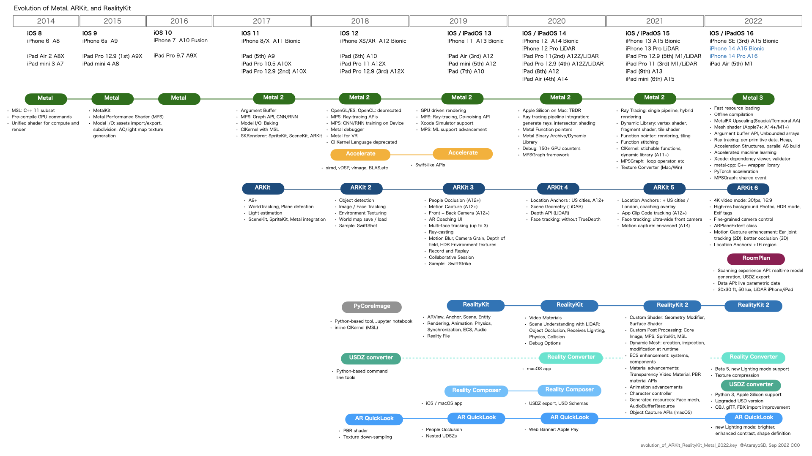
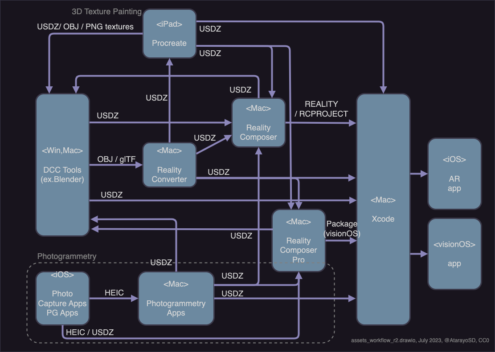

# Materials about RealityKit in iOS/iPadOS/visionOS

## Evolution of Metal, ARKit, and RealityKit

This diagram shows the evolution of Apple frameworks - Metal, ARKit, and RealityKit.

Please modify it as you like. CC0

### visionOS Ver. 2023

- File [PDF](files/evolution_of_visionOS_2023.pdf)
- File [Keynote](files/evolution_of_visionOS_2023.key)

### iOS / iPadOS Ver. 2023

- File [PDF](files/evolution_of_ARKit_RealityKit_Metal_2023a.pdf)
- File [Keynote](files/evolution_of_ARKit_RealityKit_Metal_2023a.key)

<!--
## iOS / iPadOS Ver. 2022

- File [PDF](files/evolution_of_ARKit_RealityKit_Metal_2022.pdf)
- File [Keynote](files/evolution_of_ARKit_RealityKit_Metal_2022.key)

-->

## Asset creation workflow for AR apps

The diagram shows the asset creation workflow for AR apps in iOS / iPadOS / visionOS.

- File [PNG](files/assets_workflow_r2.png)
- File [draw.io](files/assets_workflow_r2.drawio)

* The draw.io is free online / macOS app software for making diagrams. https://app.diagrams.net
* I'll rewrite the diagram with Keynote in the future.

## MaterialX Nodes in RealityKit

This document summarizes MaterialX Specification v1.38 and MaterialX Supplemental Notes v1.38, and describes the Standard MaterialX Nodes and RealityKit Custom Nodes.
It also shows correspondence between MaterialX Standard Nodes and RealityKit implementation.  
Information about RealityKit is based on the visionOS beta. It may change with the release.

- File [PDF](files/MaterialXNodesInRealityKit_R01a.pdf)
- File [Numbers](files/MaterialXNodesInRealityKit_R01a.numbers)

## Particle System in the Reality Composer Pro

This document shows the overview of the RealityKit Particle System and the preset particles' parameters.
The explanation of each parameter is from Apple API documentation.

* Since this information is based on the beta software, the content may be changed when releasing the version 1.0.

- File [PDF](files/PresetParticlesInRealityComposerProR202308d.pdf)
- File [Keynote](files/PresetParticlesInRealityComposerProR202308d.key)

## Presentation Materials

### visionOS Meetup: ShaderGraph in RealityKit

- Sep 27, 2023, English version
- File [PDF](files/shaderGraphInRK_2023en.pdf)
- File [Numbers](files/shaderGraphInRK_2023en.key)

## Related documents

- Swift SIMD/simd Type Cheat-sheet: https://github.com/ynagatomo/Swift-SIMD-Types-Cheat-Sheet

## License

License: CC0
