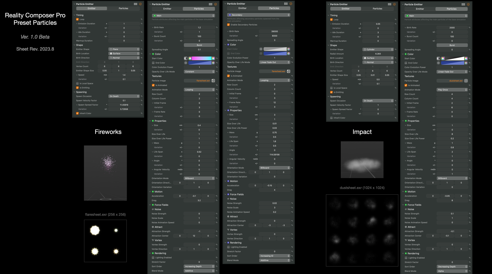

# Evolution of Metal, ARKit, and RealityKit Sheet

This sheet shows the evolution of Apple frameworks - Metal, ARKit, and RealityKit.

Please modify it as you like. CC0

## visionOS Ver. 2023

- File [PDF](files/evolution_of_visionOS_2023.pdf)
- File [Keynote](files/evolution_of_visionOS_2023.key)

## iOS / iPadOS Ver. 2023

- File [PDF](files/evolution_of_ARKit_RealityKit_Metal_2023.pdf)
- File [Keynote](files/evolution_of_ARKit_RealityKit_Metal_2023.key)

<!--
## iOS / iPadOS Ver. 2022

- File [PDF](files/evolution_of_ARKit_RealityKit_Metal_2022.pdf)
- File [Keynote](files/evolution_of_ARKit_RealityKit_Metal_2022.key)

-->

## MaterialX Nodes in RealityKit

This document summarizes MaterialX Specification v1.38 and MaterialX Supplemental Notes v1.38, and describes the Standard MaterialX Nodes and RealityKit Custom Nodes.
It also shows correspondence between MaterialX Standard Nodes and RealityKit implementation.  
Information about RealityKit is based on the visionOS beta. It may change with the release.

- File [PDF](files/MaterialXNodesInRealityKit_R01a.pdf)
- File [Numbers](files/MaterialXNodesInRealityKit_R01a.numbers)

## Particle System in the Reality Composer Pro

This document shows the preset parameters of the Particle System in the Reality Composer Pro.

* Since this information is based on the beta software, the content may be changed when releasing the version 1.0.

- File [PDF](files/PresetParticlesInRealityComposerProR202308b.pdf)
- File [Keynote](files/PresetParticlesInRealityComposerProR202308b.key)

License: CC0
