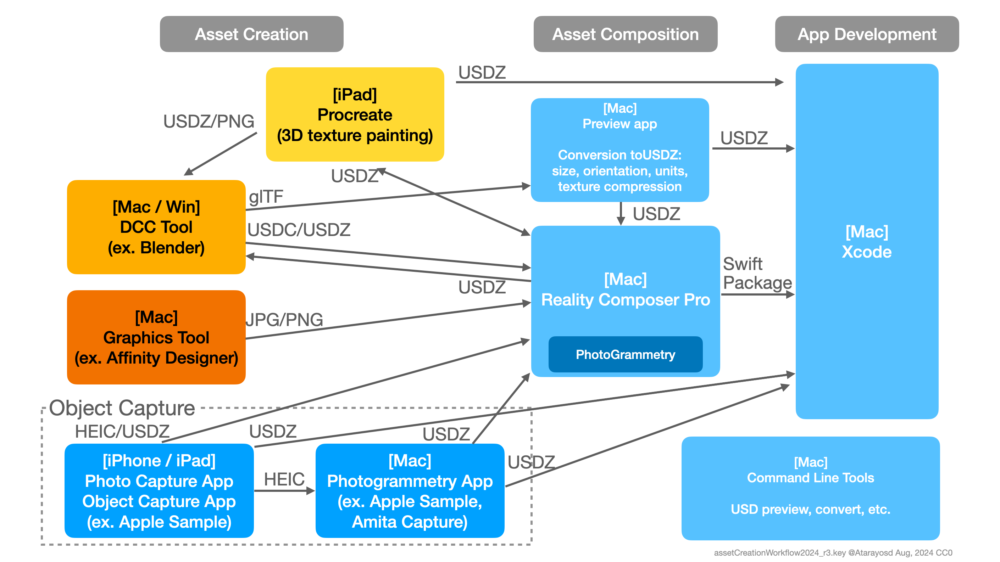
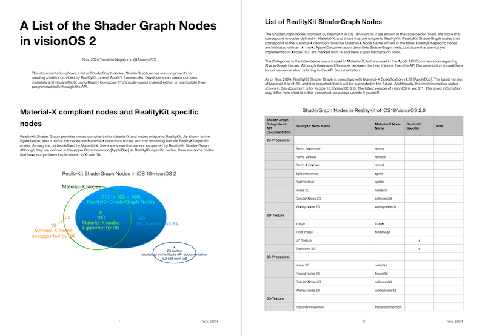

# Materials about RealityKit in iOS/iPadOS/visionOS

Here are several materials about Metal, ARKit, and RealityKit in iOS/iPadOS/visionOS.

## Progress of Metal, ARKit, and RealityKit frameworks

These diagrams show the progress of Apple Metal, ARKit, and RealityKit frameworks in iOS/iPadOS and visionOS.

Please modify and use them as you like. CC0

### Progress in visionOS, 2024

<!--

 Progress of Metal, ARKit, and RealityKit (Click to expand) 

-->

- File [PDF](files/progressOfvisionOS2024.pdf)
- File [Keynote](files/progressOfvisionOS2024.key)

<!--

-->

### Progress in iOS / iPadOS, 2024

<!--

 Progress of Metal, ARKit, and RealityKit (Click to expand) 

-->

- File [PDF](files/progressOfMetalARKitRealityKit2024b.pdf)
- File [Keynote](files/progressOfMetalARKitRealityKit2024b.key)

<!--

-->

## Asset creation workflow for AR apps

This diagram shows the asset creation workflow for AR apps in iOS / iPadOS / visionOS.

It illustrates very basic tools.
You can use other tools such as InstaMAT for material creation, Spline for 3d scene creation, and EmberGen / After Effects for texture creation.
You can also use Game Engine's built-in tools.
They are not included in this diagram.

 Asset creation workflow (Click to expand) 

- File [PDF](files/assetCreationWorkflow2024_r3.pdf)
- File [Keynote](files/assetCreationWorkflow2024_r3.key)

When exporting USDZ from Blender to Reality Composer Pro (RCP), you need to convert the orientation from Z-up in Blender to Y-up in RCP.
You have two options to do the conversion. See the pros and cons of them.

 3D Model Orientation Conversion From Blender (Z-up) to RCP (Y-up) (Click to expand) 

- File [PDF](files/modelConversionFromBlenderToRCP_r1.pdf)
- File [Keynote](files/modelConversionFromBlenderToRCP_r1.key)

## ShaderGraph Nodes in RealityKit

This documentation shows a list of ShaderGraph nodes. ShaderGraph nodes are components for creating shaders provided by RealityKit, one of Apple's frameworks. Developers can create complex materials and visual effects using Reality Composer Pro's node-based material editor, or manipulate them programmatically through the API.

<!--
 -->

- File [PDF](files/List_of_ShaderGraph_Nodes_in_visionOS2_Nov2024.pdf) [CC0]
- File [Pages](files/List_of_ShaderGraph_Nodes_in_visionOS2_Nov2024.numbers) [CC0]

## MaterialX Nodes in RealityKit

This document summarizes MaterialX Specification v1.38 and MaterialX Supplemental Notes v1.38, and describes the Standard MaterialX Nodes and RealityKit Custom Nodes.
It also shows correspondence between MaterialX Standard Nodes and RealityKit implementation.  
Information about RealityKit is based on the visionOS beta. It may change with the release.

 MaterialX Nodes in RealityKit (Click to expand) 

- File [PDF](files/MaterialXNodesInRealityKit_R01a.pdf)
- File [Numbers](files/MaterialXNodesInRealityKit_R01a.numbers)

## Particle System in the Reality Composer Pro

This document shows the overview of the RealityKit Particle System and the preset particles' parameters.
The explanation of each parameter is from Apple API documentation.

* Since this information is based on the beta software, the content may be changed when releasing the version 1.0.

 Asset creation workflow (Click to expand) 

- File [PDF](files/PresetParticlesInRealityComposerProR202308d.pdf)
- File [Keynote](files/PresetParticlesInRealityComposerProR202308d.key)

## Presentation Materials

### visionOS Meetup: ShaderGraph in RealityKit

This is a presentation slide about ShaderGraph materials in visionOS.

 Asset creation workflow (Click to expand) 

- Sep 27, 2023
- File [PDF](files/shaderGraphInRK_2023en.pdf)
- File [Keynote](files/shaderGraphInRK_2023en.key)

- File (Japanese) [PDF](files/shaderGraphInRK_2023.pdf)
- File (Japanese) [Keynote](files/shaderGraphInRK_2023.key)

## Related documents

- Swift SIMD/simd Type Cheat-sheet: https://github.com/ynagatomo/Swift-SIMD-Types-Cheat-Sheet

## License

License: CC0
